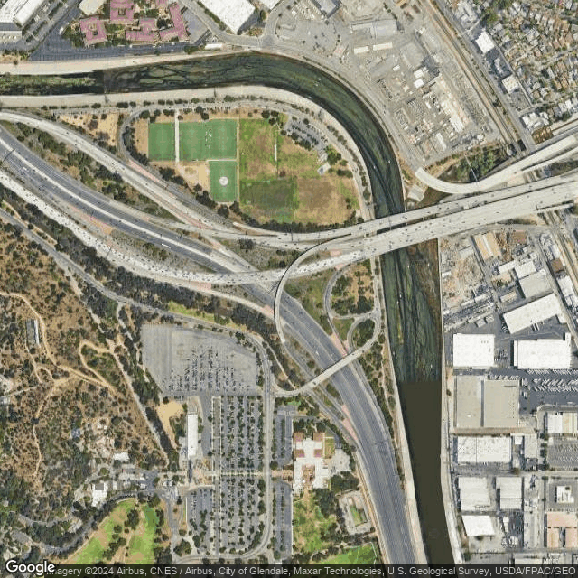

# Road Overpass Detection in Satellite Imagery

## What This Does

This project uses a CNN to detect road overpasses in satellite imagery. Feed it a satellite image and it tells you whether there's an overpass in it or not.

I trained the model on thousands of satellite images that I automatically labeled using OpenStreetMap data. It hits around 92% accuracy on the validation set.

## Live Demo

There's a demo running on Hugging Face Spaces: [Road Overpass Detector Demo](https://huggingface.co/spaces/jableable/road_project)

You can drop in coordinates and see what the model thinks. No setup required.

<p align="center">
  
</p>
<p align="center">
  <em>Screenshot: The live Streamlit app running on Hugging Face Spaces</em>
</p>

## How It Works

**Data Collection:** I used the Google Maps Static API to grab satellite images from different regions (North America, Europe, Asia). Instead of manually labeling thousands of images, I wrote a script that queries OpenStreetMap via OSMnx to count how many overpass crossings are in each image. This gave me labels automatically.

<div align="center">
  <table>
    <tr>
      <td align="center" style="padding: 10px;">
        <br/>
        <em>Raw satellite image</em>
      </td>
      <td align="center" style="padding: 10px;">
        <br/>
        <em>With OpenStreetMap road graph overlay</em>
      </td>
    </tr>
  </table>
</div>

**The Model:** It's a straightforward CNN built in TensorFlow/Keras. I added some data augmentation (random flips, brightness tweaks) to make it more robust. The model outputs a probability - like "95% confident there's an overpass here."

**The Demo:** Built a simple Streamlit app where you can enter lat/long coordinates, fetch the satellite tile, and get an instant prediction. It's deployed on Hugging Face Spaces so anyone can try it.

## Installation

Clone the repository:
```bash
git clone https://github.com/jableable/my_road_project.git
cd my_road_project
```

**Option 1: Conda (recommended)**  
Create the environment using the provided `environment.yml`:
```bash
conda env create -f environment.yml
conda activate roadproject
```

**Option 2: Pip (lightweight)**  
Install the minimal pinned dependencies:
```bash
pip install -r requirements.txt
```

**Google Static Maps API (optional)**  
If you want to generate new satellite tiles or run the full demo, set your Google Static Maps API key as an environment variable:
```bash
# Linux / macOS
export goog_api="YOUR_API_KEY"

# Windows (PowerShell)
setx goog_api "YOUR_API_KEY"
```

## Usage

**Easiest option:** Just use the [web demo](https://huggingface.co/spaces/jableable/road_project). 

**Use in your own code:**
```python
from keras.models import load_model
import numpy as np
from PIL import Image

model = load_model("0.0008-0.92.keras")  # or binary_classification_model.keras
img = Image.open("your_image.png").convert("RGB").resize((640, 640))
img_array = np.array(img)[None, ...]  # no /255, model rescales internally

pred = model.predict(img_array)
prob_overpass = pred[0][1] * 100  # second value is overpass probability

print(f"Overpass probability: {prob_overpass:.2f}%")
```

The model outputs an overpass probability between 0% and 100%.

> **Note:** The trained model file (~2.3 GB) isn't in this repo. You can grab it from the Hugging Face Space or retrain it yourself.

**Retrain from scratch:**

1. Generate a dataset using the scripts in `dataset_generation/` (fetch images, label them with OSM data)
2. Preprocess using `dataset_processing/`
3. Train: `python model/binary_classification_model.py`

Training from scratch requires ~12k images and a GPU.

## Credits

- **OpenStreetMap & OSMnx** - for the road network data that made automatic labeling possible
- **Google Static Maps API** - for the satellite imagery
- **TensorFlow/Keras** - for the deep learning framework
- **Streamlit & Hugging Face Spaces** - for making the demo simple to deploy

## License

MIT License - use it however you want. See LICENSE file.


